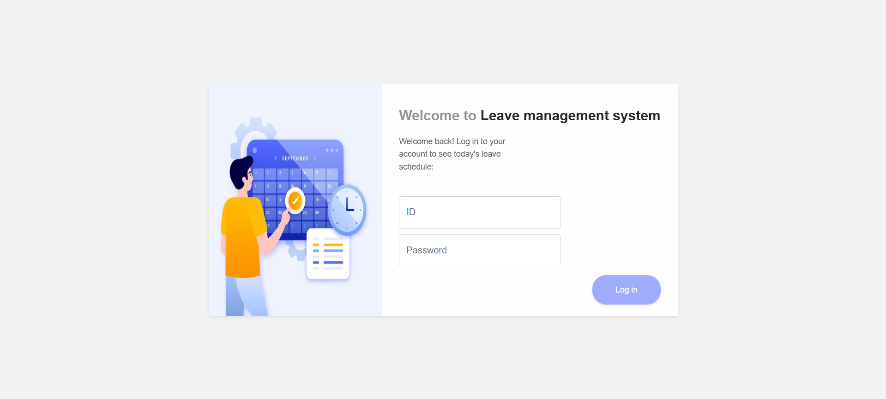

## Project Name
Leave Management System

## Description
This project is designed to Manage employee leave.

## Installation
1. Clone the repository:
   ```bash
   git clone https://github.com/Minhtui/leave_management_system.git

## Technologies Used
- Java
- Spring Web
- Spring MVC
- Spring Data JPA
- MySQL
- Thymeleaf
- HTML/CSS/JavaScript

## Screenshot

### Login


### Admin: Add New Employees


### Admin: Employees List


### Admin: Update Employee


### Admin: View Leave Details


### Admin: View Pending Leaves


### Employee: Add For Leave


### Employee: Personal Details


### Employee: Profile


### Employee: View Leave Details


### Employee: View Leave Status

